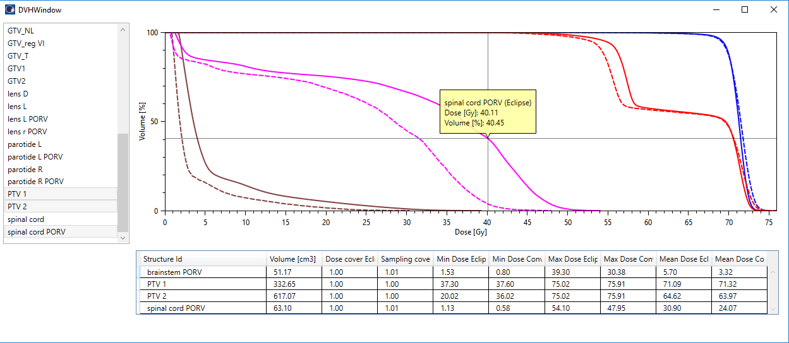

# EQD2/BED converter
This Varian ESAPI script converts nominal dose distributions to EQD2 or BED dose distributions.


## Setup

To use the script, you must compile it on your system. You should be able to open the project with Visual Studio 2019 Community Edition. Open the .sln file. 
The script was developed for Eclipse version 15.6. It may not work with other versions of Eclipse or Varian ESAPI.

1. You will need to restore NuGet package for compilation: OxyPlot. Right click the solution -> Restore NuGet packages.
2. Don't forget the references to Varian dlls.
3. Compile as Release for x64.

## How to use the script

To use the script do this:

1. Run the script on the original plan. Define alpha/beta and click the button "Create plan...".
2. A message windows will pop up. In most cases the first two scaling factors are equal, and the last one is 1. 
3. A verification plan will show up in the tree. This plan has no beams, only a (modified) dose distribution.
4. You can use this plan to create plan sums etc.


## How to preview the conversion

You can also preview the conversion without actually saving it to a verification plan. Edit the alpha/beta table and click **Preview**. A new window will pop up. On the left side you can select which structures you would like to see superimposed on the dose plot. The left and right OxyPlot regions will show the original and modified dose distributions. Here is a list of hints:

* You can scroll both dose distributions with the scroll wheel or by moving the bottom slider left and right.
* The right (modified) dose distribution is linked with the left dose distribution, but not vice-versa. To pan the distribution press the middle mouse button or use the keyboard arrow keys. To region-zoom the distribution right click and draw a rectangle. To reset the display double right click. To zoom in/out press the CTRL button and scroll.
* Left mouse button displays the tracker. The tracker is synced between both plots.
* Both distributions use the same colormap. You can change the range of the colors by moving the slider on the right side, or by entering new values in the text boxes. When you type in a new value you must hit the Enter key.
* You can change the selection of structures in-vivo. If you press the CTRL key, you can select multiple structures.

Dose is displayed in Grays. If you don't see the correct unit, create a new issue or start a new discussion. It should be easy to fix the script for other units. More is to come when I find the time.

The displayed contours are not interpolated between image slices. This means that the image slice will not always change with dose slice.


## Dose-volume histogram

You can preview the DVH by clicking the DVH button. A new window will open. Solid lines are calculated with Eclipse on the original dose distribution. Dashed lines are calculated from the modified (converted) dose distribution. The calculation for the latter uses the simplest algorithm possible. There is no additional sampling of the dose distribution, the algorithm only uses the raw dose voxels with centers inside the structure to calculate the histogram. This means that the accuracy of the histogram is low, because on the edges of the structure we are loosing bins that would contribute to the histogram. However, in most case, when one is trying to estimate things, it will work. If you wish to increase the accuracy, you must recalculate the dose with smaller voxels.

When a particular structure is not fully covered with dose, the calculation result in this script will be similar to that of Eclipse. This is sort of botched-up with some rescaling just to get the volume at dose 0 to be the same.




## Details

1. The calculation is performed with the well known formulas: EQD2 = D ( a/b + D/n) / (a/b + 2) and BED = D (1 + D / ( n a/b)). The third option, Multiply by a/b, is for testing purposes, ie. it simply multiples each voxel value with a/b.
2. The accuracy of conversion equals the width of the dose matrix box. Do some testing to see how it works.
3. The scanning for voxels inside structures is done only in the X direction.
4. When you define a/b for each structure, you have to decide how the script will deal with overlapping regions. Using "Ascending": structures will be ordered in ascending order of a/b. Meaning that the structure with lower a/b will have all voxels overridden with new values, but the overlapping part of structures with higher a/b will not have values overridden for those voxels that are inside structures with lower a/b. For "Descending" the opposite applies. See image below.
5. If you need better accuracy, calculate the original plan with smaller dose box width.
6. The conversion should (only) work for HFS, HFP, FFS, FFP orientations. If you are summing up plans based on different registered images, the result may be wrong. I haven't had time to test this.


## Log

* (12.11.2021) Added the preview window.
* (5.12.2021) Changed the script completely, following the suggestion by @Kiragroh. Now exporting and importing the dose matrix is not needed, everything is done in Eclipse.
* (6.1.2022) 
	* Fixed the display of contours in Preview for orientations other than HFS.
	* Fixed the calculation of image slice in Preview.
	* Added Help.
	* Added the option of inverting colors on DVH.
	* Added a dialog window where the user can input plan name.
	* Added the waiting window.
	* Introduced a third scaling factor that is used to fix raw pixel values in the verification plan. 


## Important note

**Before using this program see the [licence](https://github.com/brjdenis/VarianESAPI-EQD2Converter/blob/master/LICENSE) and make sure you understand it. The program comes with absolutely no guarantees of any kind.**

```
THE SOFTWARE IS PROVIDED "AS IS", WITHOUT WARRANTY OF ANY KIND, EXPRESS OR
IMPLIED, INCLUDING BUT NOT LIMITED TO THE WARRANTIES OF MERCHANTABILITY,
FITNESS FOR A PARTICULAR PURPOSE AND NONINFRINGEMENT. IN NO EVENT SHALL THE
AUTHORS OR COPYRIGHT HOLDERS BE LIABLE FOR ANY CLAIM, DAMAGES OR OTHER
LIABILITY, WHETHER IN AN ACTION OF CONTRACT, TORT OR OTHERWISE, ARISING FROM,
OUT OF OR IN CONNECTION WITH THE SOFTWARE OR THE USE OR OTHER DEALINGS IN THE
SOFTWARE.
```


## LICENSE

Published under the MIT license. 