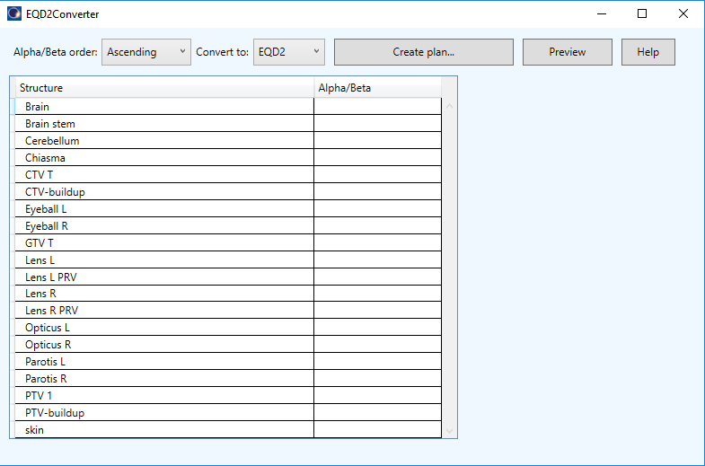
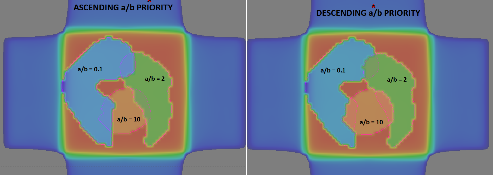

# EQD2/BED converter
This script can be used to convert nominal dose distributions to EQD2 or BED dose distributions. It should used only for experimentation purposes.



## Setup

To use the script, you must compile it on your system. You should be able to open the project with Visual Studio 2019 Community Edition. Open the .sln file in Dosimetry folder. 
The script was developed for Eclipse version 15.6. It may not work with other versions of Eclipse or Varian ESAPI.

1. You will need to restore NuGet package for compilation: Evil-Dicom version 2.0.4. Right click the solution -> Restore NuGet packages.
2. Don't forget the references to Varian dlls.
3. Compile as Release for x64.

## How to use

Because it is not possible to modify the dose matrix inside ESAPI, a trick is needed. The dose distribution is modified outside Eclipse with EvilDICOM, and is then imported back to Eclipse:

1. Copy the plan that you would like to convert to EQD2/BED. 
2. Export the plan dose distribution of the copied plan to an external dicom file.
3. Delete the copy of the plan in Eclipse.
4. Run the script on the original plan. Define alpha/beta and click the button. Pick the exported dicom file when asked.
5. When you see the message "Done!", close the script.
6. Create a new plan in Eclipse. Do not add fields to the plan, but make sure that the StructureSet assigned is the same as in the original plan.
7. Import the dicom dose file and attach it to the created empty plan. That is all. At the end you will have a plan without any fields, but with a valid dose distribution.


## Details

1. The calculation is performed with the well known formulas: EQD2 = D ( a/b + D/n) / (a/b + 2) and BED = D (1 + D / ( n a/b)). The third option, Multiply by a/b, is for testing purposes, ie. it simply multiples each voxel value with a/b.
2. The accuracy of conversion equals the width of the dose matrix box. Do some testing to see how it works. The scanning for voxels inside structures is done only in the X direction.
3. When you define a/b for each structure, you have to decide how the script will deal with overlapping regions. Using "Ascending": structures will be ordered in ascending order of a/b. Meaning that the structure with lower a/b will have all voxels overridden with new values, but the overlapping part of structures with higher a/b will not have values overridden for those voxels that are inside structures with lower a/b. For "Descending" the opposite applies. See image below.
4. If you need better accuracy, calculate the original plan with smaller dose box width.




## Important note

**Before using this program see the [licence](https://github.com/brjdenis/VarianESAPI-EQD2Converter/blob/master/LICENSE) and make sure you understand it. The program comes with absolutely no guarantees of any kind.**

```
THE SOFTWARE IS PROVIDED "AS IS", WITHOUT WARRANTY OF ANY KIND, EXPRESS OR
IMPLIED, INCLUDING BUT NOT LIMITED TO THE WARRANTIES OF MERCHANTABILITY,
FITNESS FOR A PARTICULAR PURPOSE AND NONINFRINGEMENT. IN NO EVENT SHALL THE
AUTHORS OR COPYRIGHT HOLDERS BE LIABLE FOR ANY CLAIM, DAMAGES OR OTHER
LIABILITY, WHETHER IN AN ACTION OF CONTRACT, TORT OR OTHERWISE, ARISING FROM,
OUT OF OR IN CONNECTION WITH THE SOFTWARE OR THE USE OR OTHER DEALINGS IN THE
SOFTWARE.
```


## LICENSE

Published under the MIT license. 